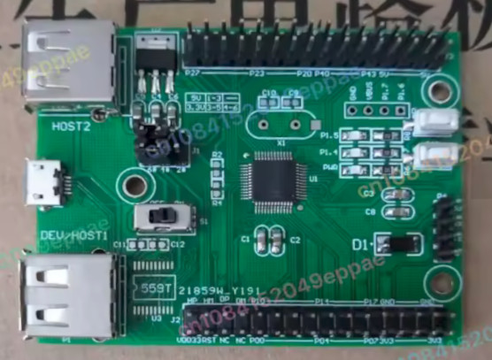

# CH559 Example

This is a minimal project example for the [CH559 evaluation board](https://aliexpress.com/item/1005008798554305.html)

## Development environment
This project contains a working environment for [VisualStudio Code](https://code.visualstudio.com). \
To open the project, either
* open the folder with VisualStudio Code or
* double-click on the [vs.code-workspace](vs.code-workspace) file

VisualStudio Code will open and ask (Dialog on bottom right corner) to re-open the workspace in a container. \
This is mandatory to use the DevContainer setup, please allow by clicking **Reopen in container**.

VisualStudio will
* build the [Docker-Container](.devcontainer/Dockerfile) (if this is the fist time this Container is used - will tage a short amount of time) \
  This will install/build all required tools to build/flash the firmware.
* present to you the folder within a container environment.

Now VisualStudio Code can be used as if the folder would be opened locally having the set of tools installed on the host machine.

Currently supported (by Menu -> Terminal -> Run Task ):
* **build** the firmware
* **flash** the firmware

## Blinky project
This sample is intent as a basic sample. It is build by Makefile and can be easily adopted to own/bigger projects (simply replace/add files to [src](src) or [inc](inc) folders). \
The Makefile will scan the files in [src](src) folder automatically.

additional Makefile targets:
* **size** \
  print information about firmware sections
* **flash** \
  program board via USB by [isp55e0](https://github.com/frank-zago/isp55e0) tool.

## Some helpful documentation links

[CH559 Programming (Part 1): Setup and blinky](https://kprasadvnsi.com/posts/bare-metal-ch559-pt1) \
[CH559 Programming (Part 2): Using Makefile](https://kprasadvnsi.com/posts/bare-metal-ch559-pt2) \
[CH559 Programming (Part 3): Memory Organization](https://kprasadvnsi.com/posts/bare-metal-ch559-pt3) \
[CH559 Programming (Part 4): Using UART](https://kprasadvnsi.com/posts/bare-metal-ch559-pt4) \
[CH559 Programming (Part 5): Working with GPIO](https://kprasadvnsi.com/posts/bare-metal-ch559-pt5)

[English Datasheet CH559DS1.PDF](https://www.wch-ic.com/downloads/CH559DS1_PDF.html) \
[English Web-Docs for CH559 Microcontroller](https://kprasadvnsi.github.io/CH559_Doc_English)

[original CH559.h header](https://github.com/zhuhuijia0001/ch559-usb-host/blob/master/CH559.h) \
[SDCC-formated CH559.h header](https://github.com/atc1441/CH559sdccUSBHost/blob/master/CH559.h) (which is part of this sample)

