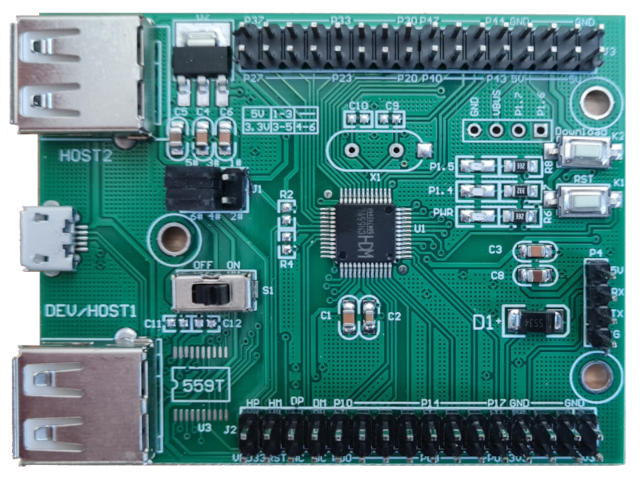

# CH559 Example

This is a minimal project environment example for the **CH559 evaluation board**:



## Development environment
This project contains a working [DevContainer](https://code.visualstudio.com/docs/devcontainers/containers) environment for [VisualStudio Code](https://code.visualstudio.com). \
This means all required tools are automatically installed in a Docker environment.

This setup has been tested on a **Linux** Host, should run on a **Mac** too.

**Windows** isn't supported for now, as Docker doesn't pass USB devices properly to the container environment. \
May be if the required tools ([sdcc](https://sdcc.sourceforge.net), [libusb](https://github.com/libusb/libusb/wiki/Windows), [isp55e0](https://github.com/frank-zago/isp55e0)/[chprog](https://github.com/ole00/chprog)) have been installed manually, the setup could work on a Windows host too (without DevContainer).

### Prerequisites
You need
* [VisualStudio Code](https://code.visualstudio.com)
* [Dev Containers plugin](https://marketplace.visualstudio.com/items?itemName=ms-vscode-remote.remote-containers) \
  (this extension is already refered in the [extensions.json](.vscode/extensions.json#L7) and will be installed automatically)
* [Docker](https://docs.docker.com/install)

installed on your system.

Open the project by one of these possibilities:
* open the folder with VisualStudio Code (Menu -> **File** -> **Open Folder**...)
* open the folder from File Manager by right-mouse-button -> Open With -> VisualStudio Code
* double-click on the [vs.code-workspace](vs.code-workspace) file
* open the folder by commandline
  ```
  code <path-to-this-folder>
  ```
* open the workspace file by commandline
  ```
  code <path-to-this-folder/vs.code-workspace>
  ```

VisualStudio Code will open and
1. ask (Dialog on bottom right corner) to install the recommanded plugins. \
   **&#9432;** This is mandatory to use the DevContainer setup, please allow by clicking **Install recommended plugins**.
2. ask (Dialog on bottom right corner) to re-open the workspace in a container. \
   **&#9432;** This is mandatory too to use the DevContainer setup, please allow by clicking **Reopen in container**.
3. build the [Docker-Container](.devcontainer/Dockerfile) \
   This will install/build all required tools to build/flash the firmware. \
   If this is the fist time this Container is used this step will take a short amount of time.
4. present to you the folder within a container environment.

Now VisualStudio Code can be used as if the folder would be opened locally having the set of tools installed on the host machine.

Currently supported (by Commandline or by Menu -> **Terminal** -> **Run Task**):
* [**build**](.vscode/tasks.json#L9-L20) the firmware (calls `make`)
* [**flash**](.vscode/tasks.json#L23-L36) the firmware (calls `make flash`)

## Blinky project
This sample is intent as a basic sample to show the development environment, which simply blinks an LEDs (aka **hello world** on embedded boards). \
It is built by Makefile and can be easily adopted to own/bigger projects (simply replace/add files to [src](src) or [inc](inc) folders). \
The Makefile will scan for *.c files in [src](src) folder automatically.

There are other CH559 development boards available with slightly different IO mapping, so if your board uses different GPIOs for the LEDs simply change the [pin definition](src/blinky.c#L6) matching your LED pin assignment.

## Board programming
The board can be programmed via USB. \
To enter the USB bootloader please
* connect the board with a MicroUSB cable
* press the **Download** button (**K2**) while switching on the board.

The board can then be programmed with the command
```
make flash
```
or by Menu->Terminal->Run Task and select **flash**. \

It [uses](Makefile#L62) the [isp55e0](https://github.com/frank-zago/isp55e0) tool, which is already [installed](.devcontainer/Dockerfile#L51-L57) in the docker environment. \
If you use this project without docker, please make sure to have this tool in your `$PATH`.

Other flashing tool alternatives:
* [chprog](https://github.com/ole00/chprog) (works, can be built for Windows and Mac too)
* [wchisptool](https://github.com/rgwan/librech551) (didn't work on my board, no support for new CH559 bootloader version)
* [ch55xtool](https://github.com/MarsTechHAN/ch552tool) (Python)

## Debugging
Not available. \
Currently only some [UART](https://kprasadvnsi.com/posts/bare-metal-ch559-pt4) output for logging can be used. \
Maybe some setup with [scdbd](https://k1.spdns.de/Develop/Hardware/AVR/mixed%20docs.../doc/sdccman.html/node138.html) or an **gdb-stub** (like the one for [ESP8266](https://github.com/espressif/esp-gdbstub)) would be possible too. \
Any recommendations or input on this would be helpful.

## Some other projects for the CH559
[CH559 samples translated](https://github.com/crowdwave/ch559samplestranslated) (chinese original [here](http://www.wch.cn/downloads/CH559EVT_ZIP.html)) \
[CH559sdccUSBHost](https://github.com/atc1441/CH559sdccUSBHost) \
[CH559_EasyUSBHost](https://github.com/q61org/CH559_EasyUSBHost) \
[ch559-usb-host](https://github.com/zhuhuijia0001/ch559-usb-host) \
[HIDman](https://github.com/rasteri/HIDman) \
[some CH559 demos](https://github.com/SoCXin/CH559)

[ch554_sdcc examples](https://github.com/Blinkinlabs/ch554_sdcc)

## Some more documentation links
[ElectroDragon CH55x SDK WiKi](https://w.electrodragon.com/w/CH55X_SDK) \
[ElectroDragon SW/HW repository](https://github.com/Edragon/WCH_CH55X) (with schematics, official SDK, examples, ...)

[English Datasheet CH559DS1.PDF](https://www.wch-ic.com/downloads/CH559DS1_PDF.html) \
[English Web-Docs for CH559 Microcontroller](https://kprasadvnsi.github.io/CH559_Doc_English)

[original CH559.h header](https://github.com/zhuhuijia0001/ch559-usb-host/blob/master/CH559.h) \
[SDCC-formated CH559.h header](https://github.com/atc1441/CH559sdccUSBHost/blob/master/CH559.h) (which is part of this sample)

[CH559 Programming (Part 1): Setup and blinky](https://kprasadvnsi.com/posts/bare-metal-ch559-pt1) \
[CH559 Programming (Part 2): Using Makefile](https://kprasadvnsi.com/posts/bare-metal-ch559-pt2) \
[CH559 Programming (Part 3): Memory Organization](https://kprasadvnsi.com/posts/bare-metal-ch559-pt3) \
[CH559 Programming (Part 4): Using UART](https://kprasadvnsi.com/posts/bare-metal-ch559-pt4) \
[CH559 Programming (Part 5): Working with GPIO](https://kprasadvnsi.com/posts/bare-metal-ch559-pt5)
